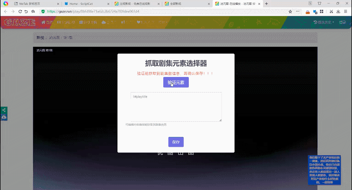

### 使用脚本前

建议先在浏览器上安装 [uBlock Origin](https://www.crxsoso.com/webstore/detail/cjpalhdlnbpafiamejdnhcphjbkeiagm) 或 [AdGuard](https://www.crxsoso.com/webstore/detail/bgnkhhnnamicmpeenaelnjfhikgbkllg) 扩展，可有效移除视频网站的视频广告。

### 脚本菜单  

1. 设置零键秒数
2. 设置倍速步进  
3. 设置快进/快退秒数    
4. 启用/禁用自动网页全屏  
5. 启用/禁用 空格 ◀▶ 键控制  
6. 启用/禁用视频倍速调节
7. 启用/禁用播放进度记录

### 快捷键

> `F` ：切换全屏  
> `P` ：切换网页全屏  
> `N` ：下一个视频  
> `D` ：弹幕开/关  
> `A` 或 `+` ：倍速 `+0.25`  
> `S` 或 `-` ：倍速 `-0.25 `  
> `Z` ：恢复正常倍速   
> 数字 `0` ：快进30秒，便于跳过片头和B站UP主广告讲解  
> 数字 `1-9` ：`1-9` 倍速  
> 空格 ：暂停/播放  
> ▶ ：快进5秒   
> ◀ ：快退5秒  
> `R`：循环旋转视频角度  
> `Shift` `R`：视频画面水平镜像翻转  

### 关于自动网页全屏

脚本默认对 `@match` 中的网址自动网页全屏。

如果不需要打开视频播放页自动网页全屏，可在脚本菜单中禁用。禁用后不会影响快捷键(P)切换。

### 关于自动退出网页全屏

脚本默认对B站和AcFun弹幕网，播放完自动退出全屏（番剧页不支持）。B站自动点击“取消连播”按钮。  

B站如果合集视频为最后一集、关闭了合集“自动连播”，也会自动退出网页全屏

如不需要该功能，注释掉：

```js
App.exitWebFullScreen();
```
### 关于 空格 ◀▶ 键控制

> 浏览器限制原因，不自动播放的视频，需要交互播放后才能操作。

主要作用是不需要聚焦到播放器也能控制播放/暂停/快进/快退，即使播放器在 `iframe` 框架页中。

默认为禁用状态，在脚本菜单中可启用，启用控制后，会覆盖播放器自带的操作。

启用控制后，可在脚本菜单设置快进/快退秒数。

### 关于播放进度记录

脚本默认启用视频播放进度记录，下次重新进入会续播上次播放进度。如果不需要该功能可在脚本菜单中禁用。

### 关于倍速播放

> 如不需要倍速播放功能，可在脚本菜单中设置禁用

默认只针对 `@match` 中的网站，<b style="color:red;">理论上</b>对所有含有 HTML5 `video` 的网页都可以倍速播放。

如果有需要的话可将脚本中的：

```js
// @note        *://*/*
```

改成：

```js
// @match        *://*/*
```

或只对某网站使用倍速控制，如**百度网盘**：

```js
// @include        *://pan.baidu.com/*
```

##### 其他

默认倍速提示时长5秒，觉得太久？

```js
// 修改为喜欢的
SHOW_TOAST_TIME: ONE_SECOND * 5
```

默认倍速提示处于视频的左下角，可选居中或右下角提示。

```js
// 修改为居中提示
SHOW_TOAST_POSITION: positions.center

// 修改为右下角提示
SHOW_TOAST_POSITION: positions.bottomRight
```

### 关于网页全屏增强

对于非默认 `@match` 中的网站，配合 <a href="https://greasyfork.org/zh-CN/scripts/4870-maximize-video" target="_blank">视频网页全屏 </a>或 [视频网页全屏（改）](https://greasyfork.org/zh-CN/scripts/495077-maximize-video-improve) 脚本，使快捷键(P) 切换网页全屏适配所有网站。

##### 前提

安装 <a href="https://greasyfork.org/zh-CN/scripts/4870-maximize-video" target="_blank">视频网页全屏</a> 或 <a href="https://greasyfork.org/zh-CN/scripts/495077-maximize-video-improve" target="_blank">视频网页全屏（改）</a> 脚本。

> 2.9.1+ 不再依赖外部脚本。

##### 使用前

把本脚本内的：

```js
// @note        *://*/*
```
改成：

```js
// @match        *://*/*
```
或只针对某个网站使用，如<a href="https://www.gugu3.com" target="_blank">咕咕番</a>：

```js
// @include      *://www.gugu3.com/*
```

> **提示**  
> 
> 推荐使用匹配所有网站方式使用，只针对某个网站使用的话，如果网站视频是在跨域 `iframe` 框架页中，还需要添加在框架页的域名匹配。  
> 
> 例如<a href="https://www.ezdmw.site/" target="_blank">E站弹幕网</a>，要按如下匹配才可以：  
> 
> ```js
> // @include      *://www.ezdmw.site/Index/video/*
> // @include      *://player.ezdmw.com/danmuku/*
> ```

##### 启用/禁用自动网页全屏

对于非默认 `@match`  的网站，可以在脚本菜单中点击 `此站点启用自动网页全屏` ；启用后在<b style="color:#e5b01e">视频开始播放</b>后自动进入网页全屏。

### 通用切换下一集

对非默认 `@match` 的视频网站，实现通用性 `N` 键切换下一集。

##### 使用前

```js
// @note        *://*/*
```
改成：

```js
// @match        *://*/*
```

##### 手动拾取元素适配

对于不能成功切换下一集或切换不正确的网站，可以手动拾取元素进行适配。

> 已拾取过的网站，要想重新拾取元素，需要先在脚本菜单中点击 `删除此站点的剧集选择器` 。

###### 1. 第一次拾取当前播放集数

键盘同时按住 `ctrl` + `alt` + 鼠标点击当前集数所在位置。拾取成功后会弹出窗口，验证元素提示成功后保存，进行第二次提取。

如果验证提示 `获取集数失败` ，编辑文本框的选择器。验证提示成功后保存。

###### 2. 第二次拾取所有集数列表的某个集数

拾取到当前集数的元素后，继续键盘同时按住 `ctrl` + `alt` + 鼠标点击所有集数列表所在的其中一个集数，弹窗验证元素、确认保存。

> 某些网站点击采集某个集数时，验证时提示获取集数失败，这时可以继续点击当前集数的位置，作为第二次采集的元素。

###### 3. 操作完成

操作完成后，可以按 `N` 键验证是否能成功切换下一集。

##### 拾取示例：

示例一：<a href="https://www.56.com/" target="_blank">56网</a> 

默认拾取到的元素选择器，验证时不能获取到当前播放集数，原因是：鼠标移入元素时动态添加了新的 `class`，失去焦点后 `class`会被移除。删除掉对该 `class` ，成功获取到当前播放的集数。 

 

示例二：<a href="https://gaze.run/" target="_blank">注视影视</a> 

在该网站，当前播放的集数在所有集数列表中没有明显的标记，不能区分出那个是当前播放的集数。

而在顶部的标题栏有当前播放的集数，第一步拾取时可选取标题栏的集数元素来获取当前集数。

 

##### 测试网站

<a href="https://www.jspoo.com/" target="_blank">聚神铺导航</a>、<a href="https://yinghezhinan.com/" target="_blank">硬核指南</a>、<a href="https://www.shandiandh.com/" target="_blank">闪电导航</a> 内的动漫影视网站。

### 更新历史

- 2.9.0
  1. 移除：`Shift` `+` / `-` 快捷键。
  2. 修复：综艺剧集列表含有非数字集时切换下集失败问题。
  3. 新增：快捷键 `R` 旋转视频角度，快捷键 `Shift` + `R` 视频画面水平镜像翻转。
  4. 新增：内置网页全屏功能增强，可不依赖外部脚本。
  5. 其他优化。
- 2.8.0
  1. 新增：自动续播上次观看进度。
  2. 第三方视频网站隐藏播放器的加载层和跳转播放提示。
  3. 自动触发开始图标进行加载视频播放（示例网站：FreeOK）。
- 2.7.5
  1. fix：剧集数为倒序时，切换下集错误问题。
  2. fix：综艺节目集数相同，集数分上中下，切换下集错误问题。
  3. fix：对使用了 `tailwindcss` 的网站 ，提取元素选择器时做特殊处理。
- 2.7.3
  1. 新增：可通过手动拾取元素来适配不能切换下一集的网站。
- 2.7.0
  1. 优化非默认匹配网站，网页全屏功能的准确性。  
  2. 新增：鼠标光标在播放器上移动，停止移动后一段时间自动隐藏光标（如<a href="https://www.mgtv.com/" target="_blank" style="color:#FF5F00">芒果TV</a>不会自动隐藏）。
  3. 新增：不在脚本默认匹配列表中的视频网站，配合<a href="https://greasyfork.org/zh-CN/scripts/495077-maximize-video-improve" target="_blank">视频网页全屏（改）</a>脚本也可以启用自动网页全屏。
  4. 新增：视频网站通用性切换下一集功能。
- 2.6.3  
  1. 新增脚本菜单：开/关倍速功能。  
- 2.6.1  
  1. 键盘事件优化。  
  2. 移除 `Alt` `+` 、`Alt` `-` 、`*` 快捷键。  
- 2.6.0
  1. 修复倍速提示精度问题。
  2. 实验性扩展功能优化，提高准确性。
  3. 新增：脚本菜单设置开/关自动网页全屏、设置倍速步进、快进/快退时长。
  4. 新增：快进(▶ 或 `Alt` `+`)、快退(◀ 或 `Alt` `-`)、暂停/播放(空格)快捷键。
  5. 多视频页增加定时监测机制，不断检查当前当前播放的`video`，实时应用倍速到新的视频。  
- 2.5.1  
  1. 适配斗鱼视频（v.douyu.com）。
- 2.4.8  
  1. 新增：数字 `0` 快捷键，快进30秒。
- 2.4.0  
  1. 自动关闭B站未登录状态下观看视频1分钟时的登录弹窗。
- v 2.3.0  
  1. 新增`Shift` `+` / `-` 快捷键，当前倍速×÷2，便于设置最高倍速。
- v 2.2.0
  1. 移除 `0` 快捷键。
  2. fix: B站直播可见性监听失效问题。
- v 2.1.0
  1. bug: 移除在`@match`中的地址鼠标悬停监听，该监听会影响腾讯视频的倍速播放。
  2. fix: **抖音网页版**为直播间时也会应用倍速问题。
  3. 新增对 [视频网页全屏（改）](https://greasyfork.org/zh-CN/scripts/495077-maximize-video-improve)  的实验性扩展。
- v 2.0.0
  1. 新增倍速播放功能。
  2. 新增页面可见性监听，当视频播放标签页不可见时会暂停播放，可见时继续播放。
- v 0.9.9
  1. 解决B站直播不支持`全屏切换`、`关闭弹幕`快捷键。
- v 0.9.7
  1. 新增`全屏(F)`、`网页全屏(P)`、`下一个视频(N)`、`弹幕开关(D)`快捷键。